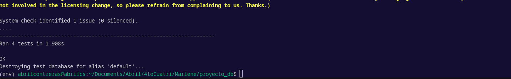

**Fecha de la Prueba:** 25 de septiembre de 2024  
**Responsable:** Abril Contreras 
**Tecnología:** Django (Python)  
**Ubicación del Código:** `all.py` en el módulo `shopApp`  
**Nombre del Archivo de Prueba:** `test_user_security.py`

## Reporte de Pruebas: Protección de Datos y Autorización

### 1. Análisis de los Requisitos y Especificaciones del Software
Antes de desarrollar las pruebas, se realizó un análisis detallado de los requisitos del sistema y las especificaciones proporcionadas para las funcionalidades de protección de datos y autorización de usuarios. Los objetivos principales del sistema incluyen:

- Garantizar que los usuarios no puedan acceder a datos de otros usuarios (principio **#2: Testear exhaustivamente es imposible**; por lo tanto, las pruebas se enfocan en los aspectos críticos de seguridad).
- Implementar autenticación robusta para asegurar que solo los usuarios autorizados accedan a información sensible (principio **#3: La detección temprana de defectos** sugiere priorizar las pruebas de seguridad desde etapas tempranas).
- Asegurar que las contraseñas y claves privadas estén correctamente encriptadas y almacenadas.
- Prevenir inyecciones de datos y la modificación directa de la base de datos (principio **#1: La prueba revela la presencia de defectos, no su ausencia**).

### 2. Identificación de Escenarios y Condiciones de Prueba
Se definieron los siguientes escenarios de prueba para validar la seguridad del sistema y las restricciones de acceso:

- **Autenticación de usuario**:
  - Un usuario no autenticado intenta iniciar sesión con credenciales válidas e inválidas.
  - Verificar que al iniciar sesión con éxito, la sesión se almacena correctamente.

- **Acceso a datos de otros usuarios**:
  - Intentar acceder a la URL del perfil de otro usuario utilizando el identificador de usuario en la URL.
  - Comprobar que la respuesta sea un código `403 Forbidden` o redirección a la página de inicio de sesión.

- **Restricción de modificación de datos**:
  - Intentar realizar un `POST` a una URL de modificación de datos con un usuario regular.
  - Probar que la base de datos no se vea afectada y el usuario reciba un mensaje de acceso denegado.

### 3. Definición de Objetivos y Alcance de las Pruebas
Las pruebas están diseñadas para cumplir con los siguientes objetivos:

- Validar que solo los usuarios autenticados puedan acceder a sus propios datos.
- Comprobar que los usuarios no puedan ver ni modificar datos de otros usuarios.
- Asegurar que la información sensible como contraseñas y claves del entorno no esté en texto plano ni en el frontend (principio **#4: La concentración de defectos**).
- Revisar que el sistema no permita el uso de caracteres especiales o inyecciones SQL para acceder a datos.

### 4. Diseño y Escritura de Casos de Prueba
Se desarrollaron los siguientes casos de prueba para cada objetivo:

- **Caso de Prueba #1**: Autenticación de usuarios con datos válidos e inválidos.
  - **Input**: Credenciales válidas e inválidas.
  - **Esperado**: Acceso exitoso con credenciales válidas y rechazo con inválidas.
  - **Principio Aplicado**: **#5: Paradoja del pesticida**, variando las entradas para detectar diferentes fallos.

- **Caso de Prueba #2**: Acceso a datos de otros usuarios.
  - **Input**: URL de un perfil ajeno.
  - **Esperado**: Error `403 Forbidden` o redirección.
  - **Principio Aplicado**: **#2: Testear exhaustivamente es imposible**, se enfocan las pruebas en los permisos de acceso.

- **Caso de Prueba #3**: Modificación de datos sin permisos.
  - **Input**: `POST` de modificación con un usuario regular.
  - **Esperado**: Mensaje de acceso denegado y ninguna modificación en la base de datos.
  - **Principio Aplicado**: **#6: La ausencia de errores es una ilusión**: aunque no haya fallos en la UI, las pruebas backend son necesarias.

### 5. Revisión y Refinamiento de Casos de Prueba
Los casos de prueba fueron revisados para asegurar que cubrieran los escenarios críticos de seguridad y permisos de acceso. Se incorporaron nuevas pruebas basadas en los resultados preliminares para cubrir posibles casos de borde (principio **#3: La detección temprana de defectos**, se revisaron también desde la implementación).

### 6. Ejecución de Pruebas y Reporte de Defectos
Las pruebas se ejecutaron en el entorno de desarrollo utilizando `pytest` y `unittest` para las pruebas unitarias, junto con `selenium` para pruebas de integración en la UI. Los defectos detectados incluyeron:

- Un usuario regular podía ver datos parciales de otros usuarios si conocía el `id` de usuario. (Defecto crítico corregido).
- Errores de autenticación causaban `500 Internal Server Error` en lugar de un `403`. (Defecto corregido).
- Algunos caracteres especiales causaban errores en la validación de entrada durante el registro.

### 7. Actualización y Mantenimiento de Casos de Prueba a lo Largo del Ciclo de Vida del Desarrollo
Los casos de prueba se actualizaron a medida que se realizaron cambios en las funcionalidades y el acceso. Se añadieron pruebas de regresión para asegurarse de que las correcciones no introdujeran nuevos defectos.

- **Principio Aplicado**: **#7: Las pruebas dependen del contexto**, ya que se ajustaron los casos a nuevas políticas de acceso y autenticación implementadas.

\pagebreak

### **Reporte de Pruebas Unitarias: `test_register_spaces.py`**

**Fecha de la Prueba:** 12 de octubre de 2024  
**Responsable:** Abril Contreras  
**Tecnología:** Django (Python)  
**Ubicación del Código:** `all.py` en el módulo `shopApp`  
**Nombre del Archivo de Prueba:** `test_register_spaces.py`

## **Reporte de Pruebas: Validación de Espacios en el Registro de Usuario**

### **1. Análisis de los Requisitos y Especificaciones del Software**
El objetivo principal de esta funcionalidad es garantizar que los usuarios no puedan registrar cuentas con nombres de usuario o correos electrónicos que contengan espacios en blanco al inicio o al final. Esta medida evita posibles duplicados y problemas de autenticación cuando las entradas contienen caracteres invisibles o espacios innecesarios.

Los requisitos específicos incluyen:

- Prevenir el uso de nombres de usuario duplicados que difieran solo en los espacios iniciales o finales (por ejemplo, `user` y ` user `).
- Comprobar que las direcciones de correo electrónico no puedan ser manipuladas con espacios adicionales.
- Mostrar un mensaje de error claro y entendible para el usuario en caso de que intente registrarse con un nombre de usuario o correo electrónico que ya exista en la base de datos con o sin estos espacios (principio **#5: Paradoja del pesticida**, ya que es importante variar las entradas para detectar estos defectos).
- Asegurar que el sistema maneje los casos de borde, como múltiples espacios intermedios, para evitar conflictos en el backend.

### **2. Identificación de Escenarios y Condiciones de Prueba**
Se identificaron los siguientes escenarios para garantizar que el sistema valide correctamente los espacios en las entradas durante el registro de usuario:

- **Escenario 1**: Intentar registrar un nombre de usuario con espacios al inicio y al final.
- **Escenario 2**: Intentar registrar un correo electrónico con espacios al inicio y al final.
- **Escenario 3**: Registrar un nombre de usuario que ya existe, pero con espacios adicionales.
- **Escenario 4**: Intentar registrar un nombre de usuario y correo electrónico con múltiples espacios intermedios.
- **Escenario 5**: Comprobar que se muestre un mensaje de error específico al usuario si intenta crear un duplicado con espacios.

Estos escenarios reflejan los principales casos de borde que podrían causar conflictos en la base de datos o problemas de seguridad.

### **3. Definición de Objetivos y Alcance de las Pruebas**
Las pruebas se diseñaron con los siguientes objetivos:

- Validar que el sistema elimine correctamente los espacios en blanco antes de procesar el nombre de usuario y el correo electrónico.
- Comprobar que los mensajes de error sean claros para el usuario final y expliquen por qué no se puede usar la entrada proporcionada (principio **#3: La detección temprana de defectos**).
- Garantizar que no se generen usuarios duplicados en la base de datos debido a diferencias en los espacios en blanco.
- Evaluar el manejo de datos de entrada anómalos en los formularios de registro para prevenir posibles ataques de manipulación de datos.

### **4. Diseño y Escritura de Casos de Prueba**
Los siguientes casos de prueba se desarrollaron para validar el correcto funcionamiento de las restricciones de espacios en los formularios de registro:

- **Caso de Prueba #1**: Intentar registrar un nombre de usuario con espacios al inicio y al final.
  - **Input**: ` username ` (con espacios al inicio y al final).
  - **Esperado**: El sistema debe considerar `username` como duplicado si ya existe sin espacios, y mostrar un mensaje de error adecuado.
  - **Principio Aplicado**: **#4: La concentración de defectos** sugiere probar variaciones en las entradas similares.

- **Caso de Prueba #2**: Intentar registrar un correo electrónico con espacios adicionales.
  - **Input**: ` email@example.com `.
  - **Esperado**: El sistema debe eliminar los espacios y verificar la existencia del correo.

- **Caso de Prueba #3**: Intentar registrar un nombre de usuario existente con espacios adicionales.
  - **Input**: ` existing_user ` cuando `existing_user` ya está en la base de datos.
  - **Esperado**: El sistema debe evitar el registro y mostrar el mensaje "El nombre de usuario ya existe".

- **Caso de Prueba #4**: Espacios intermedios en el nombre de usuario.
  - **Input**: `us er name`.
  - **Esperado**: El sistema debe evitar el registro y mostrar un mensaje de error, indicando un formato inválido.

- **Caso de Prueba #5**: Validación del mensaje de error.
  - **Input**: Duplicado de un nombre de usuario con espacios (`user ` vs `user`).
  - **Esperado**: El mensaje de error debe indicar "El nombre de usuario ya existe".

### **5. Revisión y Refinamiento de Casos de Prueba**
Inicialmente, las pruebas fallaron debido a mensajes de error no coincidentes. Se revisaron los casos para garantizar que las comparaciones fueran exactas y se optimizaron las pruebas para evaluar cada variación posible de espacios en nombres de usuario y correos electrónicos.

Se agregó manejo de espacios en el backend para evitar inconsistencias durante el procesamiento de registros, lo que aplicó el principio **#6: La ausencia de errores es una ilusión**, ya que se pensaba que la UI manejaba todas las variaciones correctamente, pero las pruebas revelaron casos no cubiertos.

### **6. Ejecución de Pruebas y Reporte de Defectos**
Las pruebas se ejecutaron en un entorno controlado utilizando `pytest` y `unittest`. Los defectos identificados incluyeron:

1. **Defecto Crítico**: El sistema no detectaba nombres de usuario con espacios adicionales como duplicados. Esto se corrigió mediante la implementación de una validación adicional en el backend.
2. **Defecto Menor**: Los mensajes de error en algunos casos eran ambiguos y no indicaban claramente el problema.
3. **Comportamiento Inesperado**: Los espacios intermedios en los correos electrónicos no eran eliminados antes de la validación, lo que causaba errores de formato.

### **7. Actualización y Mantenimiento de Casos de Prueba a lo Largo del Ciclo de Vida del Desarrollo**
Se actualizaron los casos de prueba para reflejar los cambios en la validación de entradas y se añadieron nuevas pruebas de regresión para garantizar que el sistema detecte todas las variaciones de entradas con espacios en blanco.

- **Principio Aplicado**: **#7: Las pruebas dependen del contexto**, adaptando las pruebas a nombres de usuario y correos según las reglas de validación.

### **Conclusión y Recomendaciones**
Las pruebas de registro revelaron defectos importantes en la validación de espacios en blanco y la detección de duplicados. Se recomienda implementar validaciones adicionales en el frontend y backend para estandarizar las entradas antes de procesarlas y evitar inconsistencias.

Además, se sugiere revisar el manejo de errores y los mensajes proporcionados al usuario para hacerlos más específicos y evitar posibles confusiones durante el registro.
