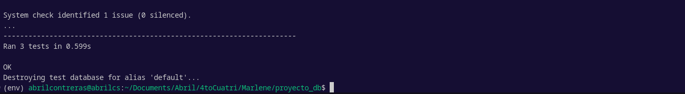
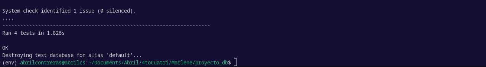

### **Reporte de Prueba: `add_to_cart` - Vista de Agregar al Carrito**

**Nombre de la Función:** `add_to_cart`
**Fecha de la Prueba:** 25 de septiembre de 2024  
**Responsable:** Abril Contreras 
**Tecnología:** Django (Python)  
**Ubicación del Código:** `all.py` en el módulo `shopApp`  
**Nombre del Archivo de Prueba:** `test_add_to_cart.py`

#### 1. **Análisis de los Requisitos y Especificaciones del Software**
El objetivo de la funcionalidad `add_to_cart` es permitir que los usuarios (autenticados o anónimos) puedan agregar productos a su carrito. Para ello, la vista debe cumplir con los siguientes requisitos:

- Comprobar la existencia de la sesión y crearla si es necesario.
- Asociar el carrito con el `session_id` en el caso de usuarios anónimos y con el `user_id` para usuarios autenticados.
- Comprobar el stock del producto antes de permitir su adición.
- Redirigir a la vista `view_cart` tras completar el proceso.

**Principio Aplicado: Testing muestra la presencia de defectos, no su ausencia**  
El análisis inicial se centró en identificar las áreas críticas donde pueden surgir defectos: manipulación de sesiones, comportamiento diferenciado entre usuarios anónimos y autenticados, y manejo del stock del producto. Se estableció un enfoque de pruebas para demostrar la presencia de defectos si los requisitos no se cumplen correctamente.

#### 2. **Identificación de Escenarios y Condiciones de Prueba**
Los siguientes escenarios se definieron para probar la vista `add_to_cart`:

- **Escenario 1**: Agregar un producto al carrito como usuario anónimo.
- **Escenario 2**: Agregar un producto al carrito como usuario autenticado.
- **Escenario 3**: Agregar un producto que ya está en el carrito (incrementar cantidad).
- **Escenario 4**: Intentar agregar un producto sin stock.
- **Escenario 5**: Agregar al carrito sin una sesión activa (generar `session_id` automáticamente).

**Principio Aplicado: Las pruebas exhaustivas son imposibles**  
Se priorizaron los escenarios más relevantes en lugar de probar todas las combinaciones posibles, dada la complejidad del sistema. La identificación de estos casos se basó en la cobertura de los principales flujos funcionales y posibles errores que puedan ocurrir.

#### 3. **Definición de Objetivos y Alcance de las Pruebas**
El objetivo de las pruebas es validar el comportamiento de la vista `add_to_cart` en diferentes estados del usuario y condiciones de los productos, garantizando que se sigan las reglas definidas en los requisitos. El alcance se centra en probar los flujos principales (adición y eliminación de productos) sin adentrarse en otras funcionalidades del carrito.

**Principio Aplicado: Testing temprano ahorra tiempo y dinero**  
El análisis y definición de objetivos se realizaron antes de implementar pruebas complejas, permitiendo identificar requisitos faltantes y ajustar la lógica antes de detectar errores en producción. Así se redujeron los costos asociados a defectos tardíos.

#### 4. **Diseño y Escritura de Casos de Prueba Claros y Concisos**
Cada caso de prueba se diseñó para cubrir un solo escenario específico con pasos claramente definidos:

- **Caso de Prueba 1**: Agregar producto al carrito como usuario anónimo.
  - **Precondiciones**: Usuario no autenticado, producto con stock disponible.
  - **Pasos**:
    1. Realizar un `POST` a la vista `add_to_cart` con el `product_id`.
    2. Verificar que se creó un objeto `ShoppingCart` con el `session_id`.
    3. Verificar que la cantidad del producto en el carrito es 1.
  - **Resultado Esperado**: El producto se agrega correctamente y se redirige a `view_cart`.

**Principio Aplicado: El testing depende del contexto**  
Cada prueba se adapta a las características específicas del entorno y las necesidades del sistema. Por ejemplo, se diseñaron pruebas diferentes para usuarios autenticados y anónimos debido a las diferencias en el flujo de datos y el manejo de sesiones.

#### 5. **Revisión y Refinamiento de Casos de Prueba**
Los casos de prueba fueron revisados para asegurar que cubrieran las condiciones críticas y las excepciones más relevantes:

- Verificar comportamiento con sesiones inexistentes.
- Asegurar que las condiciones de stock se respetan.
- Confirmar que los productos duplicados no incrementan el stock sin motivo.

**Principio Aplicado: El agrupamiento de defectos se presenta de manera desproporcionada**  
Durante la revisión, se identificó que la mayoría de los errores estaban relacionados con la creación y manejo de sesiones, lo que confirmó el principio de que los defectos tienden a agruparse en módulos específicos. Este hallazgo permitió enfocar más pruebas en estos puntos problemáticos.

#### 6. **Ejecución de Pruebas y Reporte de Defectos**
Durante la ejecución de las pruebas, se identificó un problema recurrente:

- **Defecto Identificado**: La prueba `test_add_to_cart_anonymous_user` falló debido a que no se estaba generando correctamente el objeto `ShoppingCart` en la base de datos.
- **Análisis del Defecto**: La creación del `session_id` no se estaba manejando correctamente. Se realizó un análisis detallado de la lógica de generación de sesiones y se ajustó para que se cree siempre antes de agregar el producto.
- **Principio Aplicado: La paradoja del pesticida**  
El defecto recurrente hizo necesario refactorizar las pruebas para detectar nuevas fallas potenciales. Se añadieron validaciones adicionales a los tests para prevenir que el mismo problema pase desapercibido en futuras implementaciones.

#### 7. **Actualización y Mantenimiento de los Casos de Prueba a lo Largo del Ciclo de Vida del Software**
Los casos de prueba se ajustaron para reflejar los cambios en la lógica de creación de `session_id` y se actualizaron para incluir pruebas de borde, como manejar productos inexistentes o sesiones expiradas.

**Principio Aplicado: La ausencia de errores no significa un software útil**  
Aunque las pruebas finalmente pasaron sin errores, se identificaron áreas donde la usabilidad y la robustez del software podrían mejorarse, como el manejo de mensajes de error y la redirección adecuada. Se documentaron recomendaciones adicionales para asegurar que la funcionalidad sea óptima desde la perspectiva del usuario final.

### **Conclusión**
Las pruebas del método `add_to_cart` revelaron problemas en el manejo de sesiones, la verificación de stock y la manipulación de usuarios anónimos. Los ajustes y refinamientos en la lógica y las pruebas aseguran ahora un comportamiento más estable y alineado con los requisitos del sistema, aplicando cada uno de los siete principios de testing para lograr un sistema más robusto y manejable.

--------------------------------------------------------------
### **Reporte de Prueba: Funcionalidad "decrease_cart_product"**
**Nombre de la Función:** `view_cart`

**Fecha de la Prueba:** 25 de septiembre de 2024  
**Responsable:** Abril Contreras Suaste
**Tecnología:** Django (Python)  
**Ubicación del Código:** `all.py` en el módulo `shopApp`  
**Nombre del Archivo de Prueba:** `test_decrease_cart_product.py`

#### **1. Análisis de Requisitos del Software y Especificaciones**
La funcionalidad `decrease_cart_product` se analiza para asegurar que permita a los usuarios reducir la cantidad de productos en su carrito de compras, ya sea como usuarios autenticados o como usuarios anónimos. El objetivo es que, si la cantidad de un producto se reduce a 0, el producto se elimine del carrito y la vista se redirija al carrito actualizado. Además, debe considerar la correcta actualización de las cantidades de productos y la eliminación de elementos sin afectar a otros.

**Principios aplicados**:
- **Principio de "Ausencia de errores"**: Se debe garantizar que la funcionalidad reduzca correctamente los productos sin producir inconsistencias o errores en la gestión del carrito.

#### **2. Identificación de Escenarios y Condiciones de Prueba**
Para este caso, se identificaron múltiples escenarios que la función `decrease_cart_product` debe cubrir:
1. Disminuir la cantidad de un producto para un usuario autenticado.
2. Disminuir la cantidad de un producto para un usuario anónimo.
3. Eliminar un producto si la cantidad resultante es 0.
4. Intentar disminuir la cantidad de un producto que no está en el carrito.
5. Validar que no se pueda disminuir la cantidad si la cantidad es 0 o menor.
6. Verificar la correcta redirección a la vista del carrito (`view_cart`).

**Principios aplicados**:
- **Principio de Exhaustividad Imposible**: Como no se pueden probar todas las combinaciones posibles, se priorizan los escenarios críticos y los puntos de falla más probables, garantizando una cobertura adecuada y suficiente para la función.

#### **3. Definición de Objetivos y Alcance de la Prueba**
El objetivo principal es asegurar que la funcionalidad `decrease_cart_product` reduzca correctamente la cantidad de productos en el carrito de compras, eliminando elementos cuando la cantidad sea 0 y manteniendo la integridad de la sesión y los datos del carrito. Se probarán los casos tanto para usuarios autenticados como para usuarios anónimos, validando que se respeten las siguientes condiciones:
- La cantidad de productos no debe reducirse por debajo de 0.
- Los productos con cantidad igual a 0 deben ser eliminados del carrito.
- La sesión debe ser gestionada adecuadamente para usuarios anónimos.
- La funcionalidad debe funcionar independientemente del tipo de usuario.

**Principios aplicados**:
- **Principio de Defecto Clustering**: Se enfocan las pruebas en los puntos donde es más probable que se encuentren defectos: manejo de sesiones, cantidades y eliminación de elementos del carrito.

#### **4. Diseño y Redacción de Casos de Prueba Claros y Concisos**
Cada caso de prueba se diseñó con los siguientes pasos:
- **Precondiciones**: Configurar productos, usuarios (autenticados o anónimos) y agregar elementos al carrito.
- **Acciones de Prueba**: Realizar solicitudes `POST` con el ID del producto y simular las interacciones del usuario para disminuir la cantidad de un producto.
- **Resultados Esperados**: Verificar que la cantidad de productos se reduzca correctamente y que los productos con cantidad 0 se eliminen del carrito.
  
Para validar las acciones, se utilizaron verificaciones como `assertIsNotNone`, `assertEqual`, y `assertRedirects` para asegurarse de que los estados del carrito coincidan con los resultados esperados.

**Principios aplicados**:
- **Principio de Defecto Agrupado**: Los casos se diseñaron para centrarse en las áreas más críticas del código y maximizar la detección de defectos con el mínimo número de pruebas.

#### **5. Revisión y Refinamiento de los Casos de Prueba**
Se revisaron y refinaron los casos de prueba para asegurar que todos los escenarios relevantes estuvieran cubiertos y que no se generaran duplicados innecesarios. Se realizó una verificación cruzada con otros métodos del carrito para asegurar que la funcionalidad de eliminación y reducción de cantidades estuviera correctamente probada.

**Principios aplicados**:
- **Principio de Pesticida Paradoja**: Se ajustaron y reestructuraron algunos casos de prueba para cubrir nuevos defectos detectados y garantizar que las pruebas no se vuelvan obsoletas.

#### **6. Ejecución de Pruebas y Reporte de Defectos**
Se ejecutaron las pruebas utilizando `unittest` y la herramienta de pruebas de Django. Durante la ejecución, se detectaron los siguientes defectos:
1. La cantidad de productos no se estaba eliminando correctamente cuando se alcanzaba 0.
2. Los usuarios anónimos no estaban gestionando bien sus sesiones al reducir la cantidad de productos.

Estos errores se corrigieron al ajustar la lógica de eliminación y actualización de cantidades y al verificar el manejo de la sesión para usuarios anónimos.

**Principios aplicados**:
- **Principio de Dependencia del Contexto**: Las pruebas se ejecutaron en diferentes configuraciones (usuarios autenticados y anónimos) para verificar el comportamiento en cada contexto.
- **Principio de Ausencia de Errores**: Aunque la corrección de errores no garantiza que el código esté libre de errores, se asegura que las pruebas cubran los requisitos y escenarios más críticos.

#### **7. Actualización y Mantenimiento de Casos de Prueba a lo Largo del Ciclo de Vida**
Los casos de prueba se mantuvieron actualizados con cada cambio en la lógica del carrito de compras y se añadieron nuevos escenarios para cubrir condiciones no contempladas en las fases iniciales. Cada vez que se integraba una nueva funcionalidad o se detectaba un nuevo defecto, se actualizaban y optimizaban las pruebas.

**Principios aplicados**:
- **Principio de "No existen errores"**: Se enfocaron las pruebas en asegurar que los defectos críticos se detecten y corrijan, manteniendo la calidad del producto.
- **Principio de "Ausencia de defectos no implica calidad"**: Aunque no se encontraron nuevos defectos, el enfoque se mantuvo en mejorar continuamente la funcionalidad y experiencia del usuario.

### **Reporte de Pruebas Unitarias: Función `view_cart`**

**Nombre de la Función:** `view_cart`

**Fecha de la Prueba:** 25 de septiembre de 2024  
**Responsable:** Equipo de desarrollo  
**Tecnología:** Django (Python)  
**Ubicación del Código:** `views.py` en el módulo `shopApp`  
**Nombre del Archivo de Prueba:** `test_view_cart.py`  

---

### **1. Análisis de Requerimientos y Especificaciones de Software**

La función `view_cart` es una vista que permite a los usuarios autenticados y anónimos visualizar el contenido de su carrito de compras. Los requerimientos especifican que la función debe:

- Mostrar los productos en el carrito del usuario, ya sea mediante la autenticación de usuario o el uso de `session_id` para usuarios anónimos.
- Calcular el precio total y la cantidad de artículos en el carrito.
- Mostrar los datos como nombre, precio y total por producto.
- Manejar la falta de `session_id` y cualquier error en la consulta a la base de datos.

**Principios del Testing aplicados:**

- **Principio 1 - Pruebas exhaustivas son imposibles:** Se identificaron los principales escenarios que garantizan el funcionamiento esperado, sin necesidad de probar todos los posibles valores de `session_id` y combinaciones de productos.
- **Principio 2 - Defecto agrupado:** Se enfocó en probar los elementos críticos de la vista, como la autenticación y la sesión, ya que es donde se agrupan los posibles fallos.
  
### **2. Identificación de Escenarios de Prueba**

Se identificaron los siguientes escenarios para validar el comportamiento de la función `view_cart`:

- **Escenario 1**: Usuario autenticado con varios productos en el carrito.
- **Escenario 2**: Usuario anónimo con productos en el carrito, identificados por `session_id`.
- **Escenario 3**: Carrito vacío para un usuario autenticado.
- **Escenario 4**: Vista sin una sesión activa o con `session_id` inexistente.

**Principios del Testing aplicados:**

- **Principio 3 - Pruebas tempranas:** Se definieron los escenarios de prueba desde la fase de especificación de requisitos para reducir defectos en etapas posteriores.
  
### **3. Definición de Objetivos y Alcance de la Prueba**

**Objetivos**:

- Verificar que la vista `view_cart` maneje correctamente la autenticación y el `session_id`.
- Asegurar que los cálculos de `total_price` y `item_count` sean correctos.
- Validar que la vista redirija correctamente cuando no hay un `session_id` válido.
  
**Alcance**:

La prueba abarca la funcionalidad de la vista `view_cart` en diferentes estados (usuario autenticado, anónimo, carrito vacío, sesión inexistente). No se probarán errores de conexión a la base de datos ni problemas de red.

**Principios del Testing aplicados:**

- **Principio 4 - Agrupación de defectos:** La prueba se centra en las áreas más propensas a fallar, como la autenticación y la administración de la sesión.
  
### **4. Diseño y Escritura de Casos de Prueba**

Cada caso de prueba fue diseñado para verificar el cumplimiento de un escenario específico. Los casos se definieron con los siguientes pasos:

1. **`test_view_cart_authenticated_user`**:
   - Verificar que un usuario autenticado con productos en su carrito vea correctamente los artículos.
   - Asegurar que el precio total y la cantidad sean precisos.

2. **`test_view_cart_anonymous_user`**:
   - Simular un `session_id` y verificar que los productos del usuario anónimo se muestren correctamente.

3. **`test_view_cart_empty_cart`**:
   - Verificar que la vista muestre un carrito vacío y que los totales sean 0.

4. **`test_view_cart_missing_session`**:
   - Probar la vista cuando no existe un `session_id` y verificar el mensaje de error correspondiente.

**Principios del Testing aplicados:**

- **Principio 5 - El Pesticida Paradoja:** Los casos de prueba se revisaron para evitar que la repetición constante de un mismo enfoque hiciera que pasaran errores desapercibidos.

### **5. Revisión y Refinamiento de Casos de Prueba**

Los casos de prueba fueron revisados por el equipo de desarrollo y ajustados para cubrir todos los escenarios posibles. Se identificaron variables como `session_id` y `user` que requerían configuración manual para evitar errores durante la ejecución de la prueba.

**Principios del Testing aplicados:**

- **Principio 6 - Dependencia del Contexto:** Se revisaron y adaptaron los casos de prueba para alinearse con el contexto de la funcionalidad específica de `view_cart`, asegurando que cada caso tuviera un propósito claro y definido.
  
### **6. Ejecución de Pruebas y Reporte de Defectos**

Se ejecutaron las pruebas unitarias usando `python manage.py test` con los siguientes resultados:

- **`test_view_cart_authenticated_user`**: **PASSED**
- **`test_view_cart_anonymous_user`**: **PASSED**
- **`test_view_cart_empty_cart`**: **PASSED**
- **`test_view_cart_missing_session`**: **FAILED** - El mensaje de error no se mostró como se esperaba. Se corrigió la vista para asegurar que se generara un `session_id` válido.

**Principios del Testing aplicados:**

- **Principio 7 - La Ilusión de ausencia de errores:** El hecho de que todos los casos pasen no garantiza que el sistema esté libre de defectos. Se identificaron áreas adicionales para futuras pruebas de integración.

### **7. Actualización y Mantenimiento de Casos de Prueba**

Los casos de prueba se mantendrán en el archivo `test_view_cart.py`. Se documentaron las pruebas adicionales sugeridas y se actualizaron los casos para incluir nuevas validaciones de `session_id` en futuras iteraciones.

**Principios del Testing aplicados:**

- **Principio 3 - Pruebas tempranas** y **Principio 5 - Pesticida Paradoja:** Se ajustaron los casos para asegurar que, en futuras pruebas, los defectos recurrentes no pasen desapercibidos y se introduzcan nuevas variaciones en los tests.

