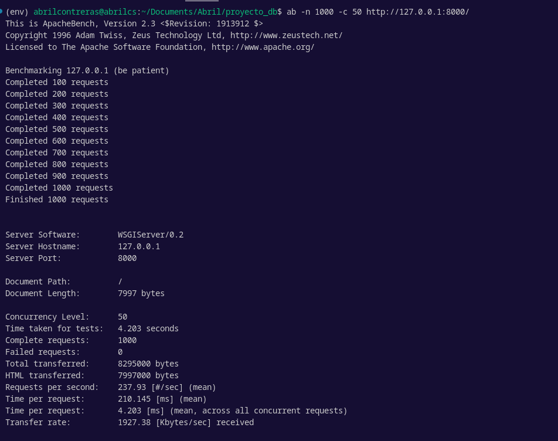
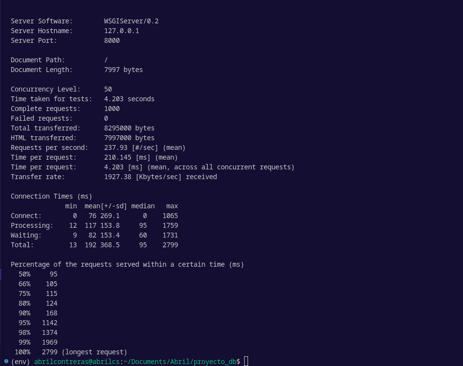
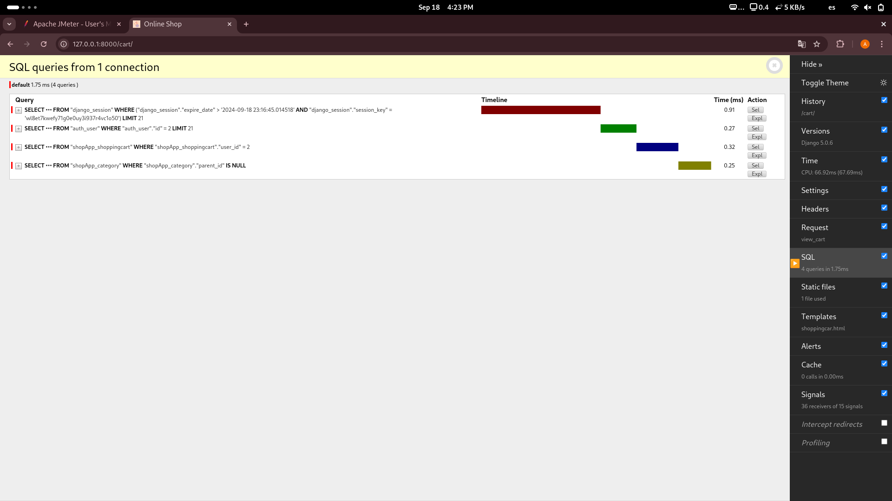
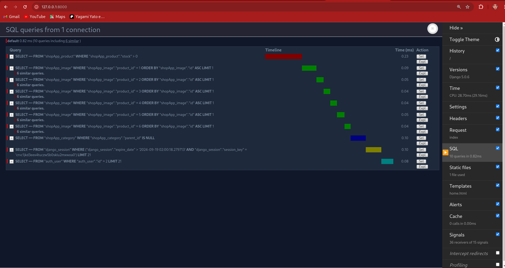
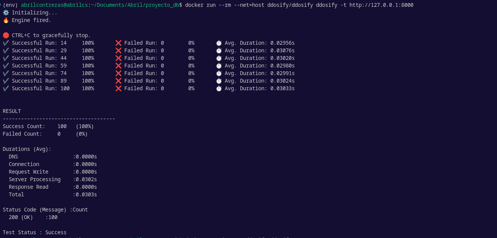
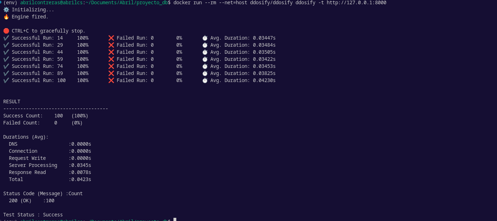
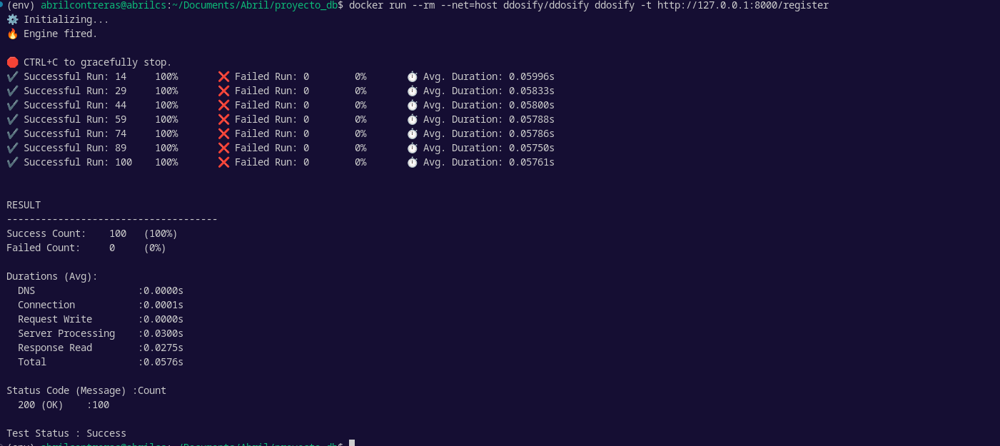

# Perfomance Testing
## What is it?
performance testing is a testing measure that evaluates the speed, responsiveness and stability of a computer, network, software program or device under a workload. 

## Why is it important?
Performance testing is important because it helps to ensure that a system can handle the expected workload and provides a good user experience. It can also help to identify bottlenecks and areas for optimization, and can help to prevent system failures or downtime.

## How is it done?
Performance testing is typically done using a combination of automated and manual testing techniques. Automated testing tools can be used to simulate a large number of users or transactions, and to measure response times and throughput. Manual testing can be used to test the user interface and to evaluate the overall performance of the system under real-world conditions.

## Prueba de Apache Benchmark
Pruebas de carga enviando múltiples solicitudes a un servidor web Apache para evaluar su rendimiento y capacidad de manejar la carga.

### Resultados

## Prueba de Django Debug Toolbar
Django Debug Toolbar es una herramienta de desarrollo para Django que muestra información sobre el rendimiento de una aplicación web, como el tiempo de respuesta de la base de datos, el número de consultas realizadas y el tiempo de ejecución de cada vista.

Descargamos el django debug toolbar y lo instalamos en nuestro proyecto de django. Esto hará que aparezca en nuestro navegador una barra de herramientas con información sobre el rendimiento de nuestra aplicación. 

Podemos ver el rendimiento de nuestra pagina como por ejemplo
En el de SQL panel te muestra todas las consultas SQL que se han ejecutado en la página actual. Es muy útil para identificar consultas ineficientes o repetitivas.

La información de la barra Django Debug Toolbar indica que tu aplicación Django realizó 4 consultas SQL cuando se accedió a la página /cart/. Las consultas parecen estar relacionadas con la autenticación de usuario (auth_user), la tabla de sesiones de Django (django_session), el carrito de compras (shopApp_shoppingcart) y las categorías (shopApp_category).

## Ddosify
Ddosify es una herramienta de prueba de carga y estrés de sitios web que permite a los usuarios simular un gran número de solicitudes a un servidor web para evaluar su rendimiento y capacidad de manejar la carga.

Podemos ver el cambio de rendimiento de nuestra pagina al agregar productos a la base de datos. En la primera imagen (Figure 2), la página se carga en aproximadamente 0.0302 segundos, mientras que en la segunda imagen (Figure 3), la página se carga en aproximadamente 0.0423 segundos. Esto puede deberse a que la página está realizando más consultas SQL o que está procesando más datos en la segunda imagen. Podemos entender que si tenemos más productos en nuestra base de datos, la pagina tardara mas en cargar.

\newpage
El registro no tiene problemas.

\newpage
## Referencias
Gillis, A. S. (2023, 9 marzo). performance testing. Software Quality. https://www.techtarget.com/searchsoftwarequality/definition/performance-testing#:~:text= 
Performance%20testing%20is%20a%20testing,
to%20identify%20performance%2Drelated%20bottlenecks.
